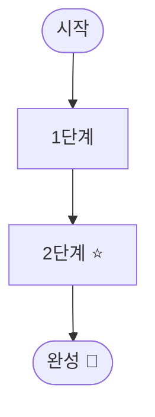

# 강의자료 등록 / 수정

코디움랩 워크스페이스의 강의자료(`materials`)를 **잘 정리된 문서로 만들어 DB(libSQL/Turso)에 등록**하는 커맨드.

입력은 **어떤 형태로 와도 됩니다** — URL · 자연어 설명 · PPT(`.pptx`) · 이미지 · 기존 문서. 이 커맨드는 그 원본을 읽어 **IT를 모르는 사람도 이해할 수 있는 강의자료 마크다운**으로 다듬은 뒤 등록합니다.

- `id` 없음 → **새 자료 등록 (INSERT)**
- `id` 있음 → **기존 자료 수정 (UPDATE)** — 전달된 필드만 갱신

> 앱 안의 [자료 관리] 화면에서도 동일하게 등록·편집할 수 있습니다. 이 커맨드는
> "대화/자료로 만들고 바로 등록"하는 흐름을 위한 보조 경로입니다.

---

## 진행 순서 — 2단계

이 커맨드는 두 단계로 나뉩니다. **1단계(본문 작성)에서는 자유롭게 도구를 쓰고**,
**2단계(등록)에서만 단일 호출** 규칙을 지키세요.

### 1단계 — 원본 읽기 & 본문 마크다운 작성

입력 형태에 맞게 원본을 확보합니다.

| 입력 | 처리 방법 |
|---|---|
| **자연어 설명** | 그대로 본문의 재료로 사용. 부족한 맥락은 사용자에게 1~2개만 질문. |
| **URL** | `WebFetch` 로 본문 추출 → 핵심만 발췌. 광고/네비 군더더기 제거. |
| **PPT (`.pptx`)** | 아래 *PPT 추출* 명령으로 슬라이드 텍스트·이미지를 뽑아 재구성. |
| **이미지** | `Read` 로 이미지를 직접 보고 내용을 글/표/머메이드로 옮김. 필요하면 이미지 자체도 본문에 첨부(아래 *이미지 첨부*). |
| **기존 문서(.md/.txt 등)** | `Read` 로 읽어 강의자료 톤으로 다듬음. |

> 입력 형태를 모르면 먼저 무엇을 받았는지부터 확인하세요(파일 경로·URL·텍스트).
> 길거나 복잡한 원본은 작성 전 **사용자에게 대상 독자·난이도·공개범위**를 짧게 확인해도 됩니다.

#### PPT 추출 (`.pptx` 인 경우)

`.pptx` 는 zip 입니다. 스크래치 디렉터리에 풀어 슬라이드 텍스트와 이미지를 뽑습니다.

```bash
# 텍스트: 각 슬라이드의 <a:t> 만 추출
unzip -o "<FILE>.pptx" -d /tmp/ppt >/dev/null
for f in /tmp/ppt/ppt/slides/slide*.xml; do
  echo "=== $f ==="
  perl -0777 -ne 'while(/<a:t>(.*?)<\/a:t>/gs){print "$1\n"}' "$f"
done
# 이미지(필요 시): /tmp/ppt/ppt/media/ 에 있음
ls /tmp/ppt/ppt/media/
```

### 2단계 — 등록 (단일 호출)

본문이 완성되면 **아래 *실행 지시* 의 명령을 1회 실행**하고 stdout JSON 을 그대로 반환합니다.

---

## 본문 작성 규칙 (중요)

대상 독자는 보통 **IT를 전혀 모르는 사람**입니다. 다시 읽어도 이해되도록 씁니다.

**렌더러가 지원하는 것** (`components/work/Markdown.tsx`, GFM):
표 · 체크리스트(`- [ ]`) · 인용블록(콜아웃) · 코드 · **머메이드 다이어그램** · 이미지 · 링크.

**권장 톤·구성**

1. **맨 위 한 줄 콜아웃**(`>`)으로 "무엇을, 무엇으로 만드는지" 요약.
2. **준비물**은 체크리스트(`- [ ]`)로.
3. **낯선 용어 사전**을 표로 먼저 풀어줌(전문용어 → 쉬운 말).
4. **전체 흐름**은 요약 표 + **머메이드 흐름도**로 한눈에.
5. **단계별 본문**: 번호 목록으로 "어디를 누르는지"까지 구체적으로. 핵심 단계엔 ⭐.
6. **팁/주의**는 콜아웃으로 — `> 💡 팁`, `> ⚠️ 주의`.
7. 마지막에 **자주 막히는 포인트(표)** + **막혔을 때** 안내.
8. 문장은 짧고 친근하게. 한 단계에 한 동작.

**머메이드 다이어그램** — 흐름·구조 설명에 적극 사용. 코드펜스로 넣으면 그림으로 렌더됩니다.
괄호 `()` 를 노드 텍스트에 넣으면 깨질 수 있으니 피하세요. 렌더 실패 시 원본이 코드블록으로 폴백됩니다.

````markdown

````

**이미지 첨부** — 본문에 이미지가 필요하면 `public/uploads/<슬러그>/` 로 복사하고 `/uploads/...` 경로로 참조합니다(앱이 `public/` 을 루트에서 서빙).

```bash
mkdir -p public/uploads/<슬러그>
cp /tmp/ppt/ppt/media/image-3-1.png public/uploads/<슬러그>/step3.png
```

```markdown

```

---

## 입력 (stdin JSON 단일 객체)

| 필드 | 필수 | 설명 |
|---|---|---|
| `id` |  | 있으면 수정 모드 |
| `title` | ✅(신규) | 자료 제목 |
| `summary` |  | 한 줄 요약 (목록 카드에 노출) |
| `body` |  | 본문 마크다운 (위 규칙대로 작성) |
| `status` |  | `draft` / `published` / `archived` (기본 `draft`) |
| `access` |  | `public`(로그인 전체) / `restricted`(권한자만, 기본) |
| `category` |  | 분류 (예: "영상 제작") |
| `tags` |  | string 배열 |
| `authorName` |  | 작성자명 (예: "코디움랩") |

> 접근권한(특정 사용자 × 기간) 부여는 앱의 [자료 관리 → 접근권한] 에서 합니다.
> 신규 자료는 기본 `restricted` + `draft` 입니다. **바로 모두에게 공개**하려면
> `status: "published"` + `access: "public"` 으로 등록하세요.

---

## 실행 지시 (2단계)

본문(`body`)은 보통 길고 줄바꿈·따옴표가 많으므로, **마크다운을 파일로 쓴 뒤 Node 로 JSON 을 만들어 파이프**하면 이스케이프 사고가 없습니다.

```bash
# 1) 본문을 파일로 저장: <SCRATCH>/body.md  (Write 도구 사용 권장)
# 2) JSON 을 만들어 등록 스크립트로 파이프
node -e '
  const fs=require("fs");
  const body=fs.readFileSync(process.env.BODY_FILE,"utf8");
  process.stdout.write(JSON.stringify({
    title:    "<제목>",
    summary:  "<한 줄 요약>",
    body,
    status:   "published",       // 또는 draft/archived
    access:   "public",          // 또는 restricted
    category: "<분류>",
    tags:     ["태그1","태그2"],
    authorName:"코디움랩",
    // 수정 시: id:"<uuid>"
  }));
' | BODY_FILE=<SCRATCH>/body.md node --env-file-if-exists=.env --env-file-if-exists=.env.local scripts/register-material.mjs
```

본문이 짧으면 inline 도 가능합니다(한국어가 깨지지 않게 single-quote 로 감쌀 것):

```bash
echo '<INPUT_JSON>' | node --env-file-if-exists=.env --env-file-if-exists=.env.local scripts/register-material.mjs
```

> **DB 타깃 주의**: 앱은 `.env` 의 `TURSO_DATABASE_URL` 을 사용합니다. 등록도 **같은 env 를 로드**해야
> 앱 화면에 보입니다(위 명령이 `.env` → `.env.local` 순으로 로드). env 가 없으면 로컬 `file:./local.db` 로 폴백됩니다.

## 응답 (stdout)

```json
{"id": "uuid-...", "ok": true, "action": "created", "title": "..."}
```

실패는 stderr + 비정상 종료. 등록 후 **id 와 함께 한 줄로 결과를 보고**하세요
(예: "등록 완료 — 제목 / public·published / id=…"). 본문에 이미지를 추가했다면
`public/uploads/...` 파일도 커밋 대상임을 알려주세요.
